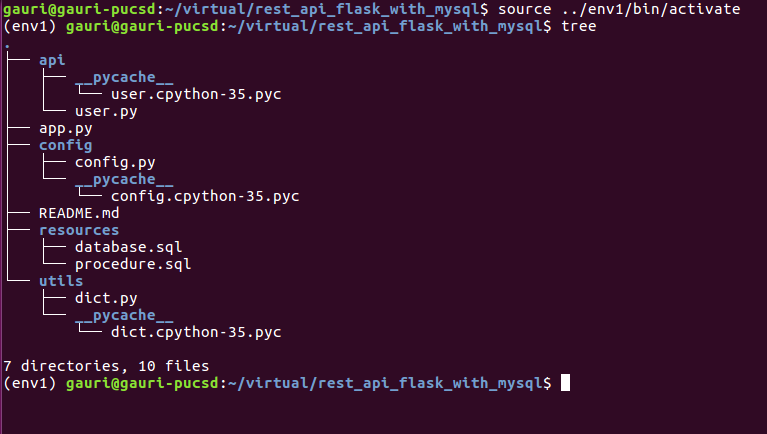

### **Flask API with all method i.e., GET,POST,PUT,PULL and PATCH for user object.**
---

## Directory Structure
---


## How to Run
---

*	Create Database using mysql script in `resource/database.sql`
*   Create all procedure in mysql using `resource/procedure.sql`
*	Run Server `python app.py`

## API call syntax using curl
---

* GET method  ```curl -X GET http://localhost:port number/users```

* DELETE method ```curl -X POST http://localhost:port number/userdel/id```

* POST method ```curl -X POST -d '{"first_name": "ABC", "last_name":"XYZ","email_id":"wzx@xz.gmail.com","contact_no":"1234567891"}' http://localhost:port number/user
 ```

## Author
---
* Name : Gaurihar Darade


